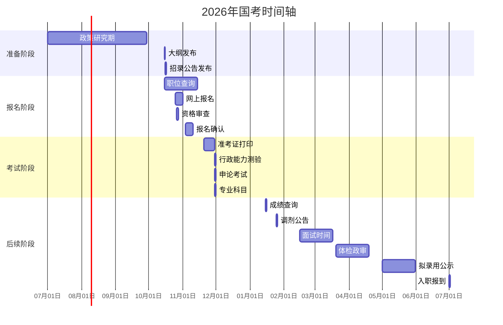

# 🏛️ 国家公务员考试资料

最后更新: 2026年04月13日  
考试年份: 2026年国考 (2027年入职)

## 1. 🎯 基本信息

| 项目       | 内容                |
| -------- | ----------------- |
| **官方名称** | 中央机关及其直属机构考试录用公务员 |
| **简称**   | 国家公务员考试 / 国考      |
| **招录单位** | 中央机关、部委、直属机构      |
| **层级**   | 国家级公务员考试          |
| **性质**   | 公务员编制考试           |
| **权威性**  | 全国最高级别公务员考试       |

## 2. 📅 2026年考试时间轴

### 2.1. 全年重要节点

### 2.2. 具体时间节点预估

| 时间段 | 关键事项 | 重要程度 |
|--------|----------|----------|
| **7-9月** | 政策研究、职位意向选择 | ⭐⭐⭐ |
| **10月上旬** | 关注考试大纲变化 | ⭐⭐⭐⭐ |
| **10月中旬** | 职位招录公告发布 | ⭐⭐⭐⭐⭐ |
| **10月下旬** | 网上报名、资格审查 | ⭐⭐⭐⭐⭐ |
| **11月上旬** | 报名确认、缴费 | ⭐⭐⭐⭐ |
| **11月下旬** | 准考证打印 | ⭐⭐⭐⭐⭐ |
| **11月底** | 笔试考试 | ⭐⭐⭐⭐⭐ |
| **12月** | 笔试阅卷 | ⭐⭐⭐ |
| **1月** | 成绩公布、分数线公布 | ⭐⭐⭐⭐⭐ |
| **2-3月** | 面试、专业能力测试 | ⭐⭐⭐⭐⭐ |
| **3-4月** | 体检、政审 | ⭐⭐⭐⭐ |
| **5月** | 拟录用公示 | ⭐⭐⭐ |
| **7月** | 正式入职 | ⭐⭐⭐ |

## 3. 📝 考试科目详解

### 3.1. 一、行政职业能力测验 (行测)

| 题型模块 | 题目数量 | 分值 | 时间 | 重点内容 |
|----------|----------|------|------|----------|
| **言语理解与表达** | 40题 | 32分 | 35分钟 | 逻辑填空、片段阅读、语句表达 |
| **数量关系** | 10题 | 20分 | 15分钟 | 数字推理、数学运算 |
| **判断推理** | 40题 | 36分 | 35分钟 | 图形推理、定义判断、类比推理、逻辑判断 |
| **资料分析** | 20题 | 20分 | 20分钟 | 文字资料、图表资料、综合资料 |
| **常识判断** | 20题 | 20分 | 10分钟 | 政治、经济、法律、历史、文化、科技等 |
| **总计** | **130题** | **120分** | **120分钟** | - |

### 3.2. 二、申论

| 题型        | 分值       | 时间        | 作答要求        |
| --------- | -------- | --------- | ----------- |
| **归纳概括题** | 10-15分   | 建议20分钟    | 提炼材料要点，简洁准确 |
| **综合分析题** | 15-20分   | 建议25分钟    | 深入分析问题，观点明确 |
| **提出对策题** | 15-20分   | 建议25分钟    | 针对性强，切实可行   |
| **应用文写作** | 10-15分   | 建议20分钟    | 格式规范，内容充实   |
| **文章论述题** | 40-50分   | 建议80分钟    | 观点鲜明，论证充分   |
| **总计**    | **100分** | **180分钟** | 约6000字      |

### 3.3. 三、专业科目考试 (部分岗位)

| 专业类别     | 招录单位   | 考试内容            | 参考用书     |
| -------- | ------ | --------------- | -------- |
| **银保监会** | 金融监管机构 | 经济金融知识、银行业保险业监管 | 《金融学》等   |
| **证监会**  | 证券监管机构 | 证券期货知识、法律法规     | 《证券基础知识》 |
| **人民警察** | 公安系统   | 公安基础知识、体能测试     | 《公安基础知识》 |
| **外交部**  | 外交部    | 英语水平测试、专业知识     | 英语专业八级   |
| **海关**   | 海关总署   | 海关专业知识、法律法规     | 《海关法律法规》 |

## 4. 👤 报名条件要求

### 4.1. 基本条件

| 条件项目   | 具体要求      | 备注说明          |
| ------ | --------- | ------------- |
| **国籍** | 中华人民共和国国籍 | 必须持有中国国籍      |
| **年龄** | 18-35周岁   | 硕士/博士可放宽到40周岁 |
| **学历** | 大专及以上学历   | 部分岗位要求本科/研究生  |
| **政治** | 拥护宪法和法律   | 无不良政治言论       |
| **品德** | 良好品行      | 无违法违纪记录       |
| **身体** | 身体健康      | 符合职位体检标准      |
| **能力** | 符合职位要求    | 专业、技能等        |

### 4.2. 不得报考情形

1. **政治问题**：曾受刑事处罚、开除公职
2. **诚信问题**：公务员考试作弊等违规行为
3. **回避关系**：有需要回避的亲属关系
4. **年龄问题**：超龄且无放宽条件
5. **在读状态**：非应届毕业生

## 5. 🏢 主要招录单位分类

### 5.1. 第一类：中央党群机关

| 单位类型 | 代表性单位 | 工作地点 | 竞争比例 |
|----------|------------|----------|----------|
| **中央机关** | 中共中央办公厅、组织部、宣传部 | 北京 | 500:1+ |
| **全国人大** | 全国人大各专门委员会 | 北京 | 300:1 |
| **全国政协** | 全国政协办公厅 | 北京 | 300:1 |
| **工会/妇联** | 全国总工会、全国妇联 | 北京 | 200:1 |

### 5.2. 第二类：中央国家行政机关

| 单位类型 | 代表性单位 | 工作地点 | 竞争比例 |
|----------|------------|----------|----------|
| **部委机关** | 发改委、教育部、科技部 | 北京 | 400:1 |
| **直属机构** | 税务总局、市场监管总局 | 北京 | 300:1 |
| **派出机构** | 各地海关、税务分局 | 各省市 | 100:1 |

### 5.3. 第三类：中央国家行政机关直属机构

| 单位类型 | 代表性单位 | 工作地点 | 竞争比例 |
|----------|------------|----------|----------|
| **金融监管** | 银保监会、证监会 | 北京/各地 | 200:1 |
| **海关系统** | 海关总署各隶属关 | 各口岸 | 150:1 |
| **税务系统** | 税务总局各分局 | 各地 | 80:1 |

### 5.4. 第四类：参照公务员法管理事业单位

| 单位类型 | 代表性单位 | 工作地点 | 竞争比例 |
|----------|------------|----------|----------|
| **参公单位** | 气象局、地震局 | 各地 | 60:1 |

## 6. 📊 近三年招录数据

| 年份 | 招录人数 | 报名人数 | 竞争比例 | 热门岗位 | 最低进面分 |
|------|----------|----------|----------|----------|------------|
| 2023年 | 3.71万人 | 250万+ | 68:1 | 邮政管理局 | 110+分 |
| 2024年 | 3.96万人 | 260万+ | 66:1 | 税务局 | 115+分 |
| 2025年 | 4.12万人 | 270万+ | 65:1 | 海关 | 118+分 |
| **2026年** | **4.30万人** | **280万+** | **65:1** | **预计类似** | **120+分** |

## 7. 📚 官方教材和推荐用书

### 7.1. 官方指定教材

| 教材名称 | 出版社 | 主要内容 | 使用建议 |
|----------|--------|----------|----------|
| **2026年国考大纲** | 国家公务员局 | 考试范围、题型说明 | 必读，打印备用 |
| **行政职业能力测验** | 中国人事出版社 | 行测全部模块 | 基础学习 |
| **申论** | 中国人事出版社 | 申论写作指导 | 基础学习 |

### 7.2. 推荐备考教材

| 系列名称 | 特点 | 适用阶段 | 推荐指数 |
|----------|------|----------|----------|
| **中公教育** | 题库全面，解析详细 | 全程备考 | ⭐⭐⭐⭐⭐ |
| **华图教育** | 技巧性强，方法新颖 | 提升阶段 | ⭐⭐⭐⭐ |
| **粉笔公考** | 线上学习，智能批改 | 巩固阶段 | ⭐⭐⭐⭐ |
| **教材通** | 基础扎实，案例丰富 | 入门阶段 | ⭐⭐⭐ |

### 7.3. 在线学习资源

| 平台名称 | 资源类型 | 特色功能 | 推荐用途 |
|----------|----------|----------|----------|
| **国家公务员局官网** | 官方公告、政策文件 | 信息权威 | 政策查询 |
| **中公网校** | 视频课程、模拟考试 | 系统全面 | 系统学习 |
| **华图在线** | 专项训练、时政热点 | 更新快速 | 查漏补缺 |
| **粉笔APP** | 每日一练、智能批改 | 碎片学习 | 日常练习 |

## 8. 🔗 重要官方链接

### 8.1. 官方网站
1. **国家公务员局**：http://www.scs.gov.cn/
2. **中央机关招录公务员专题**：http://bm.scs.gov.cn/pp/gkweb/core/web/ui/business/home/gkhome.html
3. **职位查询系统**：http://bm.scs.gov.cn/pp/gkweb/core/web/ui/business/auth/login.html

### 8.2. 报名流程指南
1. 访问专题网站 → 注册账号 → 填写个人信息
2. 职位查询筛选 → 选择报考职位 → 提交报名信息
3. 等待资格审查 → 通过后确认报名 → 网上缴费
4. 打印准考证 → 参加考试

### 8.3. 咨询渠道
- **政策咨询**：010-12370（国家公务员局）
- **技术咨询**：010-12371（报名系统技术支持）
- **各省咨询**：当地人事考试机构电话

---

> 💡 **备考建议：**
> 1. **越早越好**：建议提前8-12个月开始系统准备
> 2. **分阶段安排**：基础学习→强化训练→模拟冲刺→查漏补缺
> 3. **重点突破**：行测的言语理解和判断推理，申论的文章论述
> 4. **关注时政**：每天关注时事政治，积累申论素材
> 5. **模拟训练**：严格按照时间要求进行全真模拟
>
> 📌 **注意事项：**
> - 报名信息务必真实准确，发现虚假信息取消资格
> - 关注资格审查结果，及时确认报名
> - 考试地点和职位地点可能不同，提前规划
> - 专业科目考试以岗位要求为准，提前准备