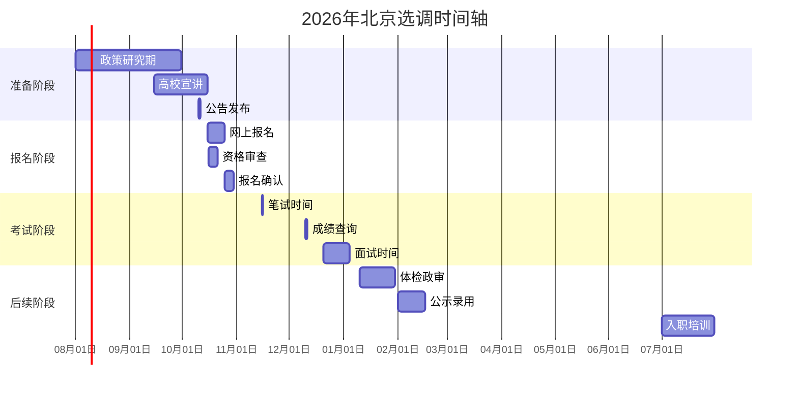

# 🏛️ 北京市选调生考试信息

最后更新: 2026年04月13日  
数据年份: 2026年招录信息

## 1. 🎯 基本信息

| 项目 | 内容 |
|------|------|
| **官方名称** | 北京市选调应届优秀大学毕业生 |
| **简称** | 北京选调 |
| **主管单位** | 北京市委组织部 |
| **招录层级** | 市级机关、区级机关 |
| **工作地点** | 北京市各区 |
| **发展特色** | 首都平台、国际化视野 |

## 2. 📊 2026年招录概况

### 2.1. 招录数据统计

| 年份 | 招录人数 | 报名人数 | 竞争比例 | 平均进面分 | 备注 |
|------|----------|----------|----------|------------|------|
| 2023年 | 450人 | 18000人 | 40:1 | 125分 | 恢复性增长 |
| 2024年 | 500人 | 20000人 | 40:1 | 128分 | 稳中有升 |
| 2025年 | 550人 | 22000人 | 40:1 | 130分 | 持续扩大 |
| **2026年** | **600人** | **24000人** | **40:1** | **132分** | **预估数据** |

### 2.2. 招录单位分布

| 单位类型 | 招录比例 | 主要单位 | 工作特点 |
|----------|----------|----------|----------|
| **市级机关** | 40% | 市委办、市政府办、发改委 | 政策制定、宏观管理 |
| **区级机关** | 50% | 各区区委办、区政府办 | 基层执行、区域发展 |
| **重点功能区** | 10% | 中关村、CBD、副中心 | 专业性强、创新要求高 |

## 3. 📅 2026年时间节点

### 3.1. 重要时间轴

### 3.2. 具体时间节点

| 时间段 | 关键事项 | 重要程度 |
|--------|----------|----------|
| **8-9月** | 关注政策变化、参加宣讲会 | ⭐⭐⭐ |
| **10月上旬** | 招录公告发布 | ⭐⭐⭐⭐⭐ |
| **10月中旬** | 网上报名、资格审查 | ⭐⭐⭐⭐⭐ |
| **11月中旬** | 笔试考试 | ⭐⭐⭐⭐⭐ |
| **12月上旬** | 成绩公布 | ⭐⭐⭐⭐⭐ |
| **12月下旬** | 面试考核 | ⭐⭐⭐⭐⭐ |
| **1月** | 体检、政审 | ⭐⭐⭐⭐ |
| **2月** | 拟录用公示 | ⭐⭐⭐ |
| **7月** | 正式入职 | ⭐⭐⭐ |

## 4. 🎓 报名条件要求

### 4.1. 基本条件

| 条件项目 | 具体要求 | 备注说明 |
|----------|----------|----------|
| **学历要求** | 全日制本科及以上 | 重点高校优先 |
| **毕业时间** | 2027年应届毕业生 | 不含往届 |
| **年龄限制** | 本科生≤24岁 硕士≤27岁 博士≤30岁 | 以报名时为准 |
| **政治面貌** | 中共党员（含预备） | 硬性要求 |
| **学生干部** | 校级或院级主要学生干部 | 任职1年以上 |
| **获奖情况** | 校级以上荣誉奖励 | 优先考虑 |
| **户籍要求** | 不限户籍 | 全国范围招录 |

### 4.2. 高校范围要求

#### 4.2.1. 第一类：重点高校（全部专业）
1. **清华大学**、北京大学
2. **中国人民大学**、北京师范大学
3. **北京航空航天大学**、北京理工大学
4. **中国农业大学**、中央民族大学

#### 4.2.2. 第二类：其他985高校（重点专业）
- 复旦大学、上海交通大学
- 浙江大学、南京大学
- 武汉大学、华中科技大学
- 中山大学、华南理工大学

#### 4.2.3. 第三类：211高校（部分专业）
- 北京地区211高校
- 各省重点211高校
- 专业需符合北京发展需求

### 4.3. 专业需求分析

| 专业类别 | 需求程度 | 主要岗位 | 发展前景 |
|----------|----------|----------|----------|
| **信息技术** | ⭐⭐⭐⭐⭐ | 智慧城市、数字经济 | 首都信息化建设 |
| **经济金融** | ⭐⭐⭐⭐⭐ | 金融监管、产业发展 | 国家金融管理中心 |
| **城市规划** | ⭐⭐⭐⭐ | 城市规划、建设管理 | 首都功能优化 |
| **法律法学** | ⭐⭐⭐⭐ | 法治建设、政策研究 | 法治中国首善之区 |
| **环境工程** | ⭐⭐⭐⭐ | 生态环境、绿色发展 | 美丽北京建设 |
| **外语类** | ⭐⭐⭐ | 国际交往、外事服务 | 国际交往中心 |

## 5. 📝 考试科目与形式

### 5.1. 笔试科目

| 科目名称 | 考试时长 | 分值 | 题型特点 | 备考重点 |
|----------|----------|------|----------|----------|
| **行政能力测验** | 120分钟 | 100分 | 客观题、题量大 | 速度与准确率 |
| **申论** | 150分钟 | 100分 | 主观题、材料多 | 政策理解与写作 |
| **专业能力测试** | 90分钟 | 50分 | 部分岗位要求 | 专业知识应用 |

### 5.2. 面试形式

| 面试类型 | 占比 | 考察重点 | 准备建议 |
|----------|------|----------|----------|
| **结构化面试** | 70% | 综合素质、应变能力 | 模拟训练、真题演练 |
| **无领导小组讨论** | 20% | 团队协作、领导能力 | 角色扮演、团队练习 |
| **专业面试** | 10% | 专业知识、岗位匹配 | 专业复习、岗位了解 |

### 5.3. 综合评价要素

| 评价维度 | 权重 | 考察方式 | 提升建议 |
|----------|------|----------|----------|
| **笔试成绩** | 50% | 统一考试 | 系统备考、模拟训练 |
| **面试表现** | 30% | 现场考核 | 表达能力、逻辑思维 |
| **综合素质** | 20% | 材料审核 | 学生干部、获奖情况 |

## 6. 🏢 培养与发展体系

### 6.1. 培养机制

| 培养阶段 | 时间 | 主要内容 | 目标 |
|----------|------|----------|------|
| **入职培训** | 1个月 | 政治理论、市情教育 | 适应首都工作 |
| **基层锻炼** | 2年 | 街道乡镇、社区村居 | 了解基层实际 |
| **轮岗交流** | 1年 | 不同部门、岗位轮换 | 拓宽工作视野 |
| **专业培训** | 持续 | 业务技能、管理能力 | 提升专业素养 |

### 6.2. 发展路径

| 发展层级 | 时间要求 | 主要岗位 | 发展前景 |
|----------|----------|----------|----------|
| **科员级** | 0-2年 | 基础业务岗位 | 熟悉工作 |
| **副科级** | 2-4年 | 业务骨干、项目负责人 | 独立承担工作 |
| **正科级** | 4-6年 | 科室负责人、团队领导 | 管理能力提升 |
| **副处级** | 6-8年 | 部门副职、专项工作 | 综合协调能力 |
| **正处级** | 8-10年 | 部门正职、区域负责人 | 战略决策能力 |

### 6.3. 薪资待遇水平

| 待遇项目 | 市级机关 | 区级机关 | 备注说明 |
|----------|----------|----------|----------|
| **月基本工资** | 8000-10000元 | 7000-9000元 | 根据级别确定 |
| **绩效奖金** | 2000-4000元 | 1500-3000元 | 年度考核结果 |
| **住房补贴** | 1500-2500元 | 1000-2000元 | 租房或购房补贴 |
| **其他福利** | 五险二金、餐补、交通补 | 标准统一 | 保障完善 |
| **年总收入** | **15-20万元** | **12-18万元** | **税前估算** |

## 7. 🔗 官方信息渠道

### 7.1. 官方网站
1. **北京组工网**：http://www.bjdj.gov.cn/
2. **北京市人社局**：http://rsj.beijing.gov.cn/
3. **首都之窗**：http://www.beijing.gov.cn/

### 7.2. 报名系统
- **北京选调生报名平台**：http://xds.bjzzb.gov.cn/
- **报名时间**：每年10月中旬
- **咨询电话**：010-12380（市委组织部）

### 7.3. 高校对接
- **清华大学就业中心**：http://career.tsinghua.edu.cn/
- **北京大学就业中心**：http://scc.pku.edu.cn/
- **中国人民大学就业中心**：http://rdjy.ruc.edu.cn/

## 8. 📈 竞争分析与备考建议

### 8.1. 竞争态势分析

| 竞争维度 | 难度评级 | 影响因素 | 应对策略 |
|----------|----------|----------|----------|
| **报名门槛** | ⭐⭐⭐⭐ | 高校范围、政治面貌 | 提前准备条件 |
| **笔试竞争** | ⭐⭐⭐⭐⭐ | 题目难度、考生水平 | 系统备考训练 |
| **面试竞争** | ⭐⭐⭐⭐⭐ | 综合素质、表达能力 | 模拟面试训练 |
| **综合考察** | ⭐⭐⭐⭐ | 全面评价、背景审核 | 全方位提升 |

### 8.2. 备考策略建议

#### 8.2.1. 第一阶段：条件准备（现在-8月）
1. **政治面貌**：确保党员身份，积极参与组织生活
2. **学生工作**：担任主要学生干部，积累管理经验
3. **荣誉奖项**：争取校级以上奖励，提升竞争力
4. **专业学习**：保持优异成绩，掌握专业知识

#### 8.2.2. 第二阶段：笔试备考（9-11月）
1. **行测训练**：每日练习，提高速度和准确率
2. **申论积累**：关注北京时政，积累写作素材
3. **模拟考试**：全真模拟，适应考试节奏
4. **错题整理**：建立错题本，针对性提高

#### 8.2.3. 第三阶段：面试准备（12月）
1. **结构化训练**：每日模拟面试，提高应变能力
2. **无领导小组**：参加团队练习，培养协作能力
3. **形象礼仪**：注意仪表仪态，展现良好形象
4. **心理调适**：保持良好心态，自信应对

### 8.3. 北京特色关注点

1. **首都功能定位**：了解"四个中心"建设
2. **京津冀协同发展**：掌握区域发展战略
3. **城市副中心建设**：关注通州发展动态
4. **冬奥遗产利用**：了解后冬奥时代发展
5. **国际交往中心**：关注外事工作特点

---

> 💡 **特别提醒：**
> 1. **政治要求高**：北京作为首都，对政治素质要求极高
> 2. **综合素质强**：注重全面发展和综合能力
> 3. **国际化视野**：需要具备一定的国际交往能力
> 4. **基层经历重**：重视基层锻炼和群众工作能力
>
> 📌 **成功关键：**
> - 提前规划，满足所有报名条件
> - 系统备考，笔试成绩是关键基础
> - 全面发展，综合素质是重要加分
> - 了解北京，体现对首都工作的热爱