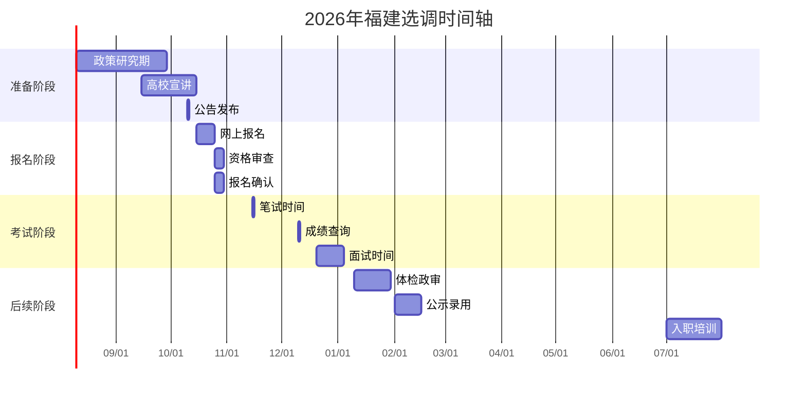

# 🌊 福建省选调生考试信息

最后更新: 2026年04月13日  
数据年份: 2026年招录信息

## 🎯 基本信息

| 项目 | 内容 |
|------|------|
| **官方名称** | 福建省选调应届优秀大学毕业生 |
| **简称** | 福建选调 |
| **主管单位** | 福建省委组织部 |
| **招录层级** | 省直机关、市直机关、县区机关 |
| **工作地点** | 福州、厦门、泉州等9个地市 |
| **发展特色** | 对台前沿、民营经济、生态省建设 |

## 📊 2026年招录概况

### 招录数据统计

| 年份 | 招录人数 | 报名人数 | 竞争比例 | 平均进面分 | 备注 |
|------|----------|----------|----------|------------|------|
| 2023年 | 450人 | 13500人 | 30:1 | 120分 | 稳定招录 |
| 2024年 | 500人 | 15000人 | 30:1 | 122分 | 小幅增长 |
| 2025年 | 550人 | 16500人 | 30:1 | 124分 | 持续扩大 |
| **2026年** | **600人** | **18000人** | **30:1** | **126分** | **预估数据** |

### 招录单位分布

| 单位类型 | 招录比例 | 主要单位 | 工作特点 |
|----------|----------|----------|----------|
| **省直机关** | 30% | 省委办、省政府办、发改委 | 政策制定、宏观管理 |
| **市直机关** | 40% | 各市市委办、市政府办 | 区域发展、城市管理 |
| **县区机关** | 30% | 各县区委办、县政府办 | 基层执行、乡村振兴 |

## 📅 2026年时间节点

### 重要时间轴

### 具体时间节点

| 时间段 | 关键事项 | 重要程度 |
|--------|----------|----------|
| **8-9月** | 关注政策变化、参加宣讲会 | ⭐⭐⭐ |
| **10月上旬** | 招录公告发布 | ⭐⭐⭐⭐⭐ |
| **10月中旬** | 网上报名、资格审查 | ⭐⭐⭐⭐⭐ |
| **11月中旬** | 笔试考试 | ⭐⭐⭐⭐⭐ |
| **12月上旬** | 成绩公布 | ⭐⭐⭐⭐⭐ |
| **12月下旬** | 面试考核 | ⭐⭐⭐⭐⭐ |
| **1月** | 体检、政审 | ⭐⭐⭐⭐ |
| **2月** | 拟录用公示 | ⭐⭐⭐ |
| **7月** | 正式入职 | ⭐⭐⭐ |

## 🎓 报名条件要求

### 基本条件

| 条件项目 | 具体要求 | 备注说明 |
|----------|----------|----------|
| **学历要求** | 全日制本科及以上 | 重点高校优先 |
| **毕业时间** | 2027年应届毕业生 | 不含往届 |
| **年龄限制** | 本科生≤25岁 硕士≤28岁 博士≤32岁 | 以报名时为准 |
| **政治面貌** | 中共党员（含预备） | 硬性要求 |
| **学生干部** | 校级或院级主要学生干部 | 任职1年以上 |
| **获奖情况** | 校级以上荣誉奖励 | 优先考虑 |
| **户籍要求** | 不限户籍，福建生源优先 | 全国范围招录 |

### 高校范围要求

#### 第一类：重点高校（全部专业）
1. **厦门大学**、福州大学
2. **华侨大学**、福建师范大学
3. **清华大学**、北京大学
4. **复旦大学**、上海交通大学

#### 第二类：其他985高校（重点专业）
- 浙江大学、南京大学
- 武汉大学、华中科技大学
- 中山大学、华南理工大学
- 四川大学、西安交通大学

#### 第三类：211高校（部分专业）
- 东南沿海地区211高校
- 各省重点211高校
- 专业需符合福建发展需求

### 专业需求分析

| 专业类别 | 需求程度 | 主要岗位 | 发展前景 |
|----------|----------|----------|----------|
| **对台工作** | ⭐⭐⭐⭐⭐ | 对台部门、外事部门 | 对台工作前沿 |
| **民营经济** | ⭐⭐⭐⭐⭐ | 经信部门、商务部门 | 民营经济发展 |
| **海洋经济** | ⭐⭐⭐⭐ | 海洋部门、港口管理 | 海洋强省建设 |
| **数字经济** | ⭐⭐⭐⭐ | 信息产业、智慧城市 | 数字福建建设 |
| **生态环保** | ⭐⭐⭐⭐ | 生态环境、绿色发展 | 生态省建设 |
| **文化旅游** | ⭐⭐⭐ | 文旅部门、景区管理 | 文旅融合发展 |

## 📝 考试科目与形式

### 笔试科目

| 科目名称 | 考试时长 | 分值 | 题型特点 | 备考重点 |
|----------|----------|------|----------|----------|
| **行政能力测验** | 120分钟 | 100分 | 客观题、题量大 | 速度与准确率 |
| **申论** | 150分钟 | 100分 | 主观题、材料多 | 政策理解与写作 |
| **专业能力测试** | 90分钟 | 50分 | 部分岗位要求 | 专业知识应用 |

### 面试形式

| 面试类型 | 占比 | 考察重点 | 准备建议 |
|----------|------|----------|----------|
| **结构化面试** | 80% | 综合素质、应变能力 | 模拟训练、真题演练 |
| **无领导小组讨论** | 15% | 团队协作、领导能力 | 角色扮演、团队练习 |
| **专业面试** | 5% | 专业知识、岗位匹配 | 专业复习、岗位了解 |

### 综合评价要素

| 评价维度 | 权重 | 考察方式 | 提升建议 |
|----------|------|----------|----------|
| **笔试成绩** | 60% | 统一考试 | 系统备考、模拟训练 |
| **面试表现** | 30% | 现场考核 | 表达能力、逻辑思维 |
| **综合素质** | 10% | 材料审核 | 学生干部、获奖情况 |

## 🏢 培养与发展体系

### 培养机制

| 培养阶段 | 时间 | 主要内容 | 目标 |
|----------|------|----------|------|
| **入职培训** | 1个月 | 政治理论、省情教育 | 适应福建工作 |
| **基层锻炼** | 2年 | 乡镇街道、农村社区 | 了解基层实际 |
| **轮岗交流** | 1年 | 不同部门、岗位轮换 | 拓宽工作视野 |
| **专业培训** | 持续 | 业务技能、管理能力 | 提升专业素养 |

### 发展路径

| 发展层级 | 时间要求 | 主要岗位 | 发展前景 |
|----------|----------|----------|----------|
| **科员级** | 0-2年 | 基础业务岗位 | 熟悉工作 |
| **副科级** | 2-4年 | 业务骨干、项目负责人 | 独立承担工作 |
| **正科级** | 4-6年 | 科室负责人、团队领导 | 管理能力提升 |
| **副处级** | 6-8年 | 部门副职、专项工作 | 综合协调能力 |
| **正处级** | 8-10年 | 部门正职、区域负责人 | 战略决策能力 |

### 薪资待遇水平

| 待遇项目 | 省直机关 | 市直机关 | 县区机关 | 备注说明 |
|----------|----------|----------|----------|----------|
| **月基本工资** | 7500-9500元 | 6500-8500元 | 5500-7500元 | 根据级别确定 |
| **绩效奖金** | 1800-3500元 | 1300-2800元 | 1000-2300元 | 年度考核结果 |
| **住房补贴** | 1200-2200元 | 1000-1800元 | 800-1500元 | 租房或购房补贴 |
| **其他福利** | 五险二金、餐补、交通补 | 标准统一 | 标准统一 | 保障完善 |
| **年总收入** | **12-18万元** | **10-15万元** | **8-13万元** | **税前估算** |

## 🔗 官方信息渠道

### 官方网站
1. **福建组工网**：http://www.fjzzb.gov.cn/
2. **福建省人社厅**：http://rst.fujian.gov.cn/
3. **福建省政府网**：http://www.fujian.gov.cn/

### 报名系统
- **福建选调生报名平台**：http://xds.fjzzb.gov.cn/
- **报名时间**：每年10月中旬
- **咨询电话**：0591-12380（省委组织部）

### 高校对接
- **厦门大学就业中心**：http://career.xmu.edu.cn/
- **福州大学就业中心**：http://career.fzu.edu.cn/
- **华侨大学就业中心**：http://career.hqu.edu.cn/

## 📈 竞争分析与备考建议

### 竞争态势分析

| 竞争维度 | 难度评级 | 影响因素 | 应对策略 |
|----------|----------|----------|----------|
| **报名门槛** | ⭐⭐⭐⭐ | 高校范围、政治面貌 | 提前准备条件 |
| **笔试竞争** | ⭐⭐⭐⭐ | 题目难度、考生水平 | 系统备考训练 |
| **面试竞争** | ⭐⭐⭐⭐ | 综合素质、表达能力 | 模拟面试训练 |
| **综合考察** | ⭐⭐⭐ | 全面评价、背景审核 | 全方位提升 |

### 备考策略建议

#### 第一阶段：条件准备（现在-8月）
1. **政治面貌**：确保党员身份，积极参与组织生活
2. **学生工作**：担任主要学生干部，积累管理经验
3. **荣誉奖项**：争取校级以上奖励，提升竞争力
4. **专业学习**：保持优异成绩，掌握专业知识

#### 第二阶段：笔试备考（9-11月）
1. **行测训练**：每日练习，提高速度和准确率
2. **申论积累**：关注福建时政，积累写作素材
3. **模拟考试**：全真模拟，适应考试节奏
4. **错题整理**：建立错题本，针对性提高

#### 第三阶段：面试准备（12月）
1. **结构化训练**：每日模拟面试，提高应变能力
2. **无领导小组**：参加团队练习，培养协作能力
3. **形象礼仪**：注意仪表仪态，展现良好形象
4. **心理调适**：保持良好心态，自信应对

### 福建特色关注点

1. **对台工作前沿**：了解闽台融合发展
2. **民营经济发展**：掌握"晋江经验"等发展模式
3. **海洋强省建设**：关注海洋经济发展
4. **数字福建建设**：了解数字经济发展
5. **生态省建设**：关注生态文明建设

---

> 💡 **特别提醒：**
> 1. **对台优势独特**：对台工作前沿和窗口
> 2. **民营经济活跃**：民营经济发展典范
> 3. **海洋资源丰富**：海洋经济发展潜力大
> 4. **生态环境优美**：生态省建设成效显著
>
> 📌 **成功关键：**
> - 了解福建对台工作的特殊重要性
> - 关注民营经济发展和创新
> - 体现服务对台前沿、建设福建的决心
> - 展现适应海洋经济和数字经济发展的能力